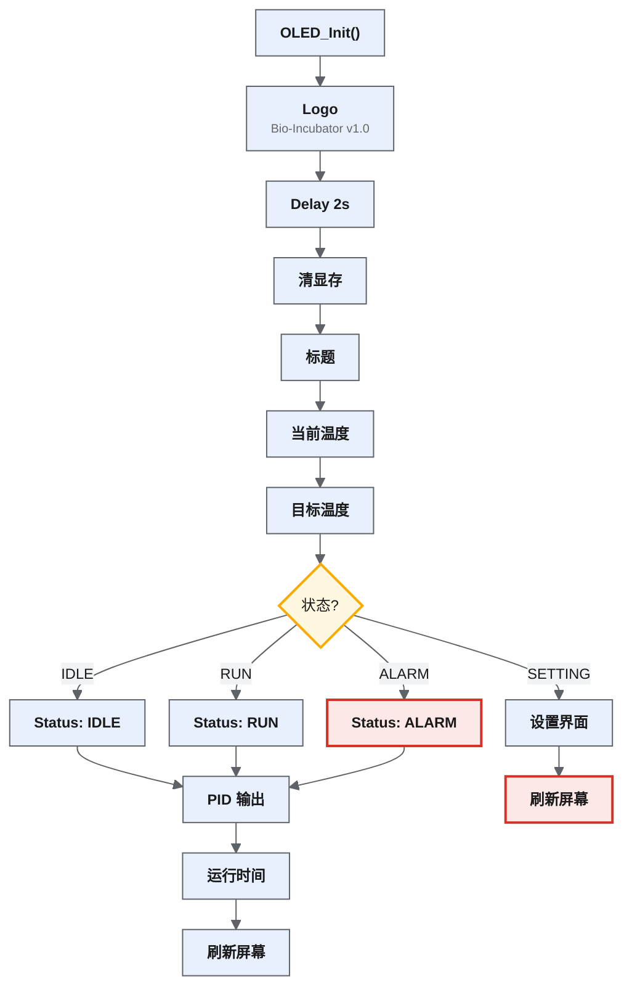

```mermaid
%%{init: {
  'theme': 'base',
  'themeVariables': {
    'primaryColor': '#E8F0FE',
    'primaryTextColor': '#1A1A1A',
    'primaryBorderColor': '#1A73E8',
    'lineColor': '#5F6368',
    'secondaryColor': '#F1F3F4',
    'tertiaryColor': '#FFF8E1',
    'fontFamily': 'Segoe UI, Arial, sans-serif',
    'fontSize': '12px'
  },
  'flowchart': {
    'curve': 'basis',
    'padding': 10,
    'nodeSpacing': 20,
    'rankSpacing': 25,
    'htmlLabels': true
  }
}}%%
graph TD
  A1["<b>OLED_Init()</b>"] --> A2["<b>Logo</b><div style='font-size:10px;color:#666'>Bio-Incubator v1.0</div>"]
  A2 --> A3["<b>Delay 2s</b>"]
  A3 --> B1["<b>清显存</b>"]
  B1 --> B2["<b>标题</b>"]
  B2 --> B3["<b>当前温度</b>"]
  B3 --> B4["<b>目标温度</b>"]
  B4 --> B5{"状态?"}
  B5 -->|IDLE| B6["<b>Status: IDLE</b>"]
  B5 -->|RUN| B7["<b>Status: RUN</b>"]
  B5 -->|ALARM| B8["<b>Status: ALARM</b>"]
  B5 -->|SETTING| B9["<b>设置界面</b>"]
  B6 --> B10["<b>PID 输出</b>"]
  B7 --> B10
  B8 --> B10
  B9 --> B13["<b>刷新屏幕</b>"]
  B10 --> B11["<b>运行时间</b>"]
  B11 --> B12["<b>刷新屏幕</b>"]

  style B5 fill:#FFF8E1,stroke:#F9AB00,stroke-width:2px
  style B8 fill:#FCE8E6,stroke:#D93025,stroke-width:2px
  style B13 fill:#FCE8E6,stroke:#D93025,stroke-width:2px
  style A1 fill:#E8F0FE,stroke:#5F6368,stroke-width:1px
  style A2 fill:#E8F0FE,stroke:#5F6368,stroke-width:1px
  style A3 fill:#E8F0FE,stroke:#5F6368,stroke-width:1px
  style B1 fill:#E8F0FE,stroke:#5F6368,stroke-width:1px
  style B2 fill:#E8F0FE,stroke:#5F6368,stroke-width:1px
  style B3 fill:#E8F0FE,stroke:#5F6368,stroke-width:1px
  style B4 fill:#E8F0FE,stroke:#5F6368,stroke-width:1px
  style B6 fill:#E8F0FE,stroke:#5F6368,stroke-width:1px
  style B7 fill:#E8F0FE,stroke:#5F6368,stroke-width:1px
  style B9 fill:#E8F0FE,stroke:#5F6368,stroke-width:1px
  style B10 fill:#E8F0FE,stroke:#5F6368,stroke-width:1px
  style B11 fill:#E8F0FE,stroke:#5F6368,stroke-width:1px
  style B12 fill:#E8F0FE,stroke:#5F6368,stroke-width:1px
```
