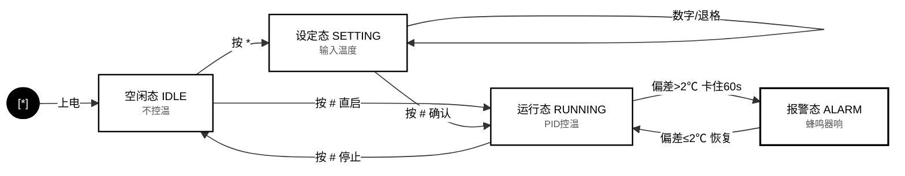
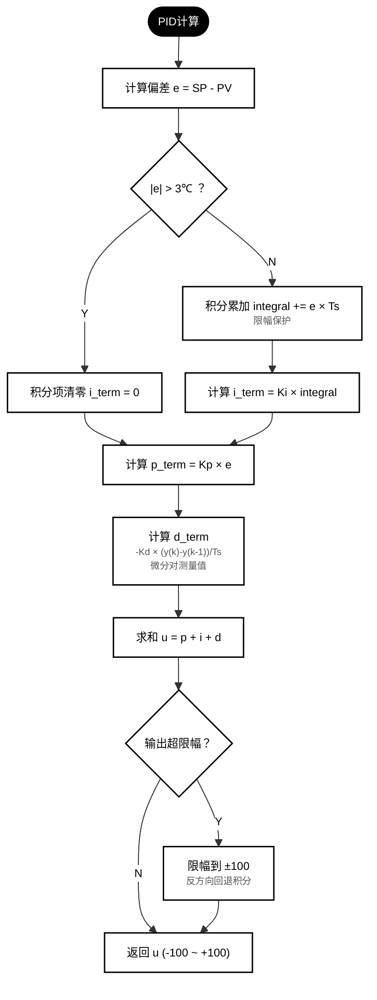
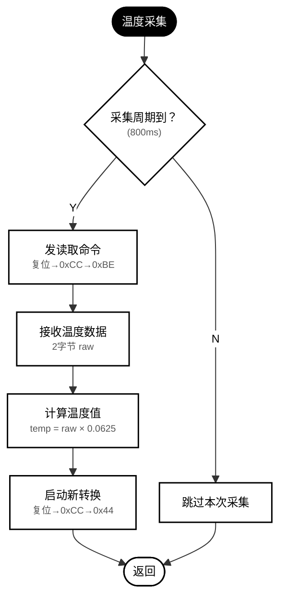
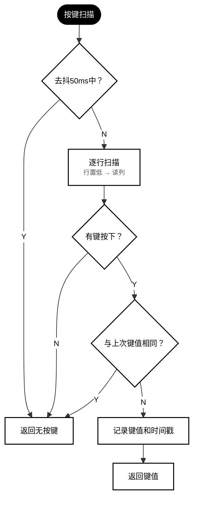
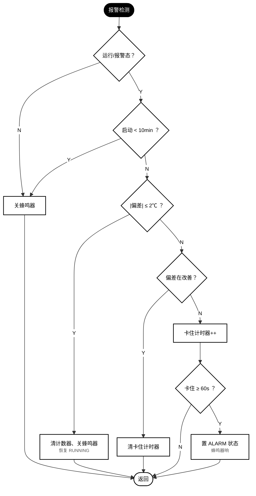
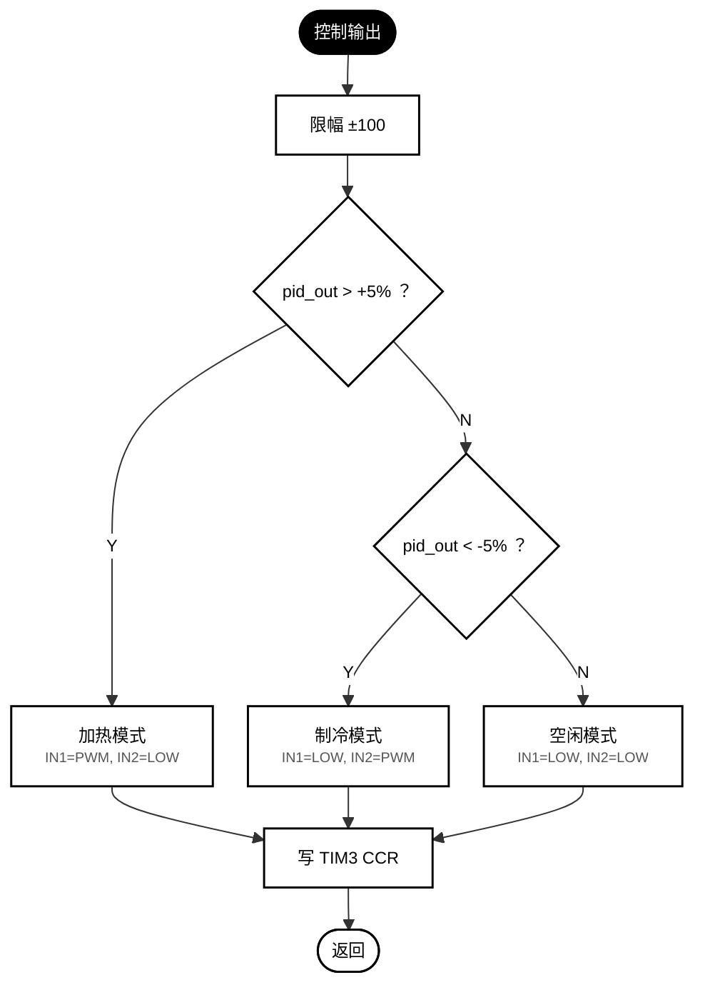
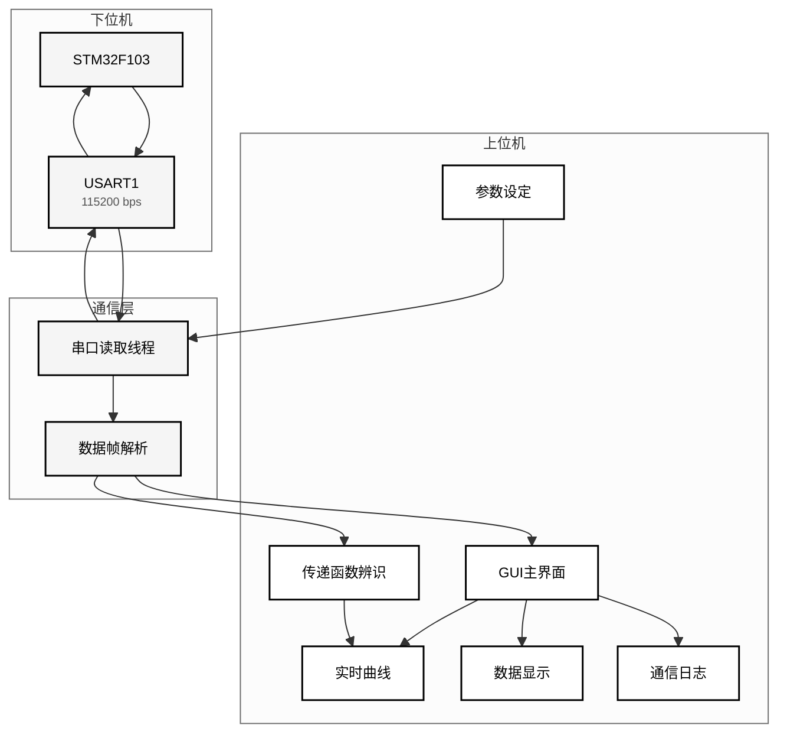

# 生化培养箱控制系统 — 软件流程图

> 规范：单主线串行架构，Y左分支/N直下，循环回流到信息上传。

---

## 图1.1 主程序流程

```mermaid
%%{init: {
  'theme': 'neutral',
  'themeVariables': {
    'primaryColor': '#FFFFFF',
    'primaryTextColor': '#000000',
    'primaryBorderColor': '#000000',
    'lineColor': '#333333',
    'secondaryColor': '#F5F5F5',
    'tertiaryColor': '#FAFAFA',
    'fontFamily': 'Times New Roman, SimSun, serif',
    'fontSize': '12px'
  },
  'flowchart': {
    'curve': 'basis',
    'padding': 12,
    'nodeSpacing': 25,
    'rankSpacing': 35,
    'htmlLabels': true
  }
}}%%
graph LR
  Start(["开始"]) --> Init["模块初始化<div style='font-size:10px;color:#555'>• HAL/时钟/外设初始化<br/>• OLED/DS18B20/键盘初始化<br/>• PID/控制模块/串口初始化</div>"]
  Init --> Upload["信息上传"]
  Upload --> KeyCheck{"按键检测"}
  KeyCheck -->|Y| KeyProc["按键处理"]
  KeyProc --> OLEDRef["OLED刷新"]
  OLEDRef --> CycleJug
  KeyCheck -->|N| CycleJug{"控制周期到？<div style='font-size:10px;color:#555'>(200ms)</div>"}

  CycleJug -->|Y| CycleTask["控制周期任务<div style='font-size:10px;color:#555'>• DS18B20温度采集<br/>• 蜂鸣器安全守卫<br/>• 三段式报警检测<br/>• PID控制计算与输出<br/>• OLED刷新显示</div>"]
  CycleJug -->|N| UartJug
  CycleTask --> UartJug{"串口上报周期到？<div style='font-size:10px;color:#555'>(1s)</div>"}

  UartJug -->|Y| UartReport["串口数据上报"]
  UartJug -->|N| UartRx["串口接收解析"]
  UartReport --> UartRx
  UartRx --> Upload

  classDef start fill:#000,color:#FFF,stroke:#000,stroke-width:2px
  classDef process fill:#FFF,stroke:#000,stroke-width:1.5px
  classDef judge fill:#FFF,stroke:#000,stroke-width:1.5px

  class Start start
  class Init,Upload,KeyProc,OLEDRef,CycleTask,UartReport,UartRx process
  class KeyCheck,CycleJug,UartJug judge
```

> **图1.1 主程序流程图（水平布局）**。系统上电初始化后进入无限循环，依次执行按键检测、控制周期任务（200ms）、串口上报（1s），末尾回流至信息上传。

---

## 图1.2 系统状态机

> **图1.2 系统状态机**。包含空闲、设定、运行、报警四种状态，通过按键和条件事件驱动状态转移。

---

## 图1.3 PID控制算法

> **图1.3 PID控制算法**。位置式PID，偏差>3℃时积分清零防饱和，微分作用于测量值避冲击，输出限幅±100并抗积分回退。

---

## 图1.4 DS18B20温度采集（非阻塞策略）

> **图1.4 DS18B20温度采集（非阻塞策略）**。每800ms启动一次转换，非采集周期跳过，避免阻塞主循环。

---

## 图1.5 矩阵键盘扫描

> **图1.5 矩阵键盘扫描**。50ms去抖 + 连续重复键过滤，确保按键输入稳定。

---

## 图1.6 三段式报警检测

> **图1.6 三段式报警检测**。阶段一（启动10min内）不报警；阶段二偏差≤2℃清除报警；阶段三偏差持续≥2℃且60s无改善触发报警。

---

## 图1.7 BTS7960控制区段映射

> **图1.7 BTS7960 H桥控制区段映射**。PID输出经±100限幅后，按死区±5%划分为加热/空闲/制冷三区段，通过TIM3输出PWM。

---

## 图1.8 Python上位机软件架构

> **图1.8 Python上位机软件架构**。上位机通过串口与下位机通信，实现实时数据显示、参数设定、传递函数辨识及数据记录功能。
